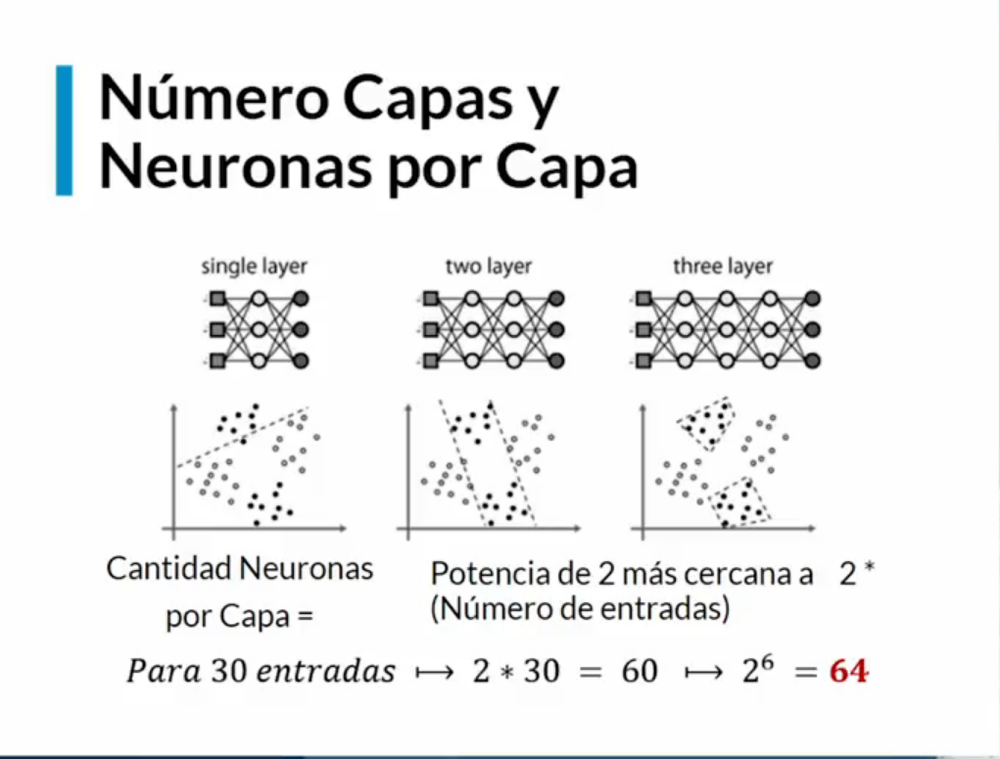
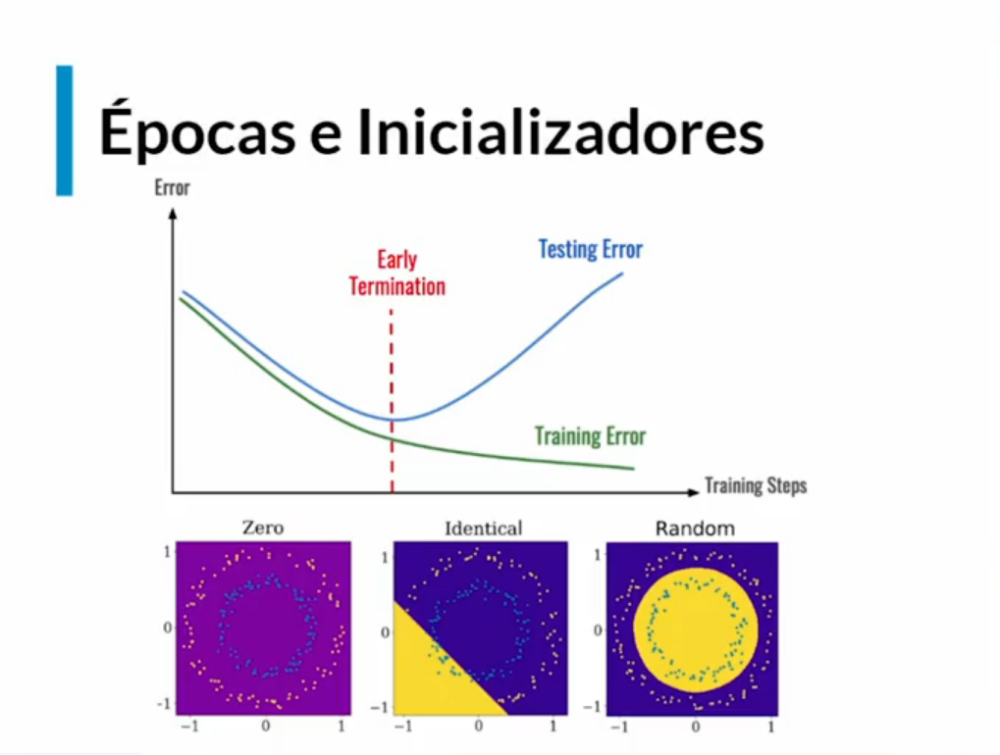
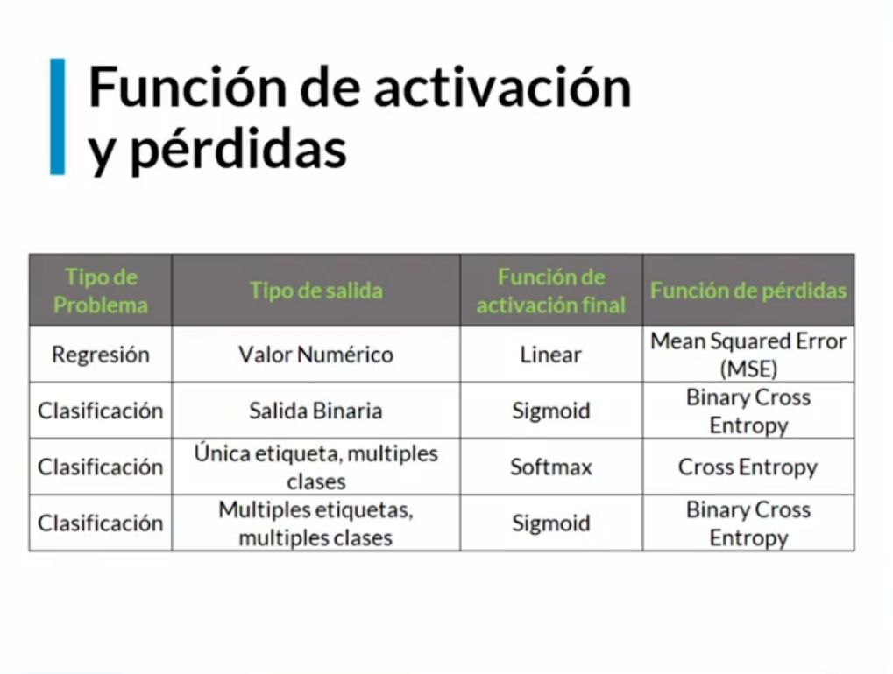
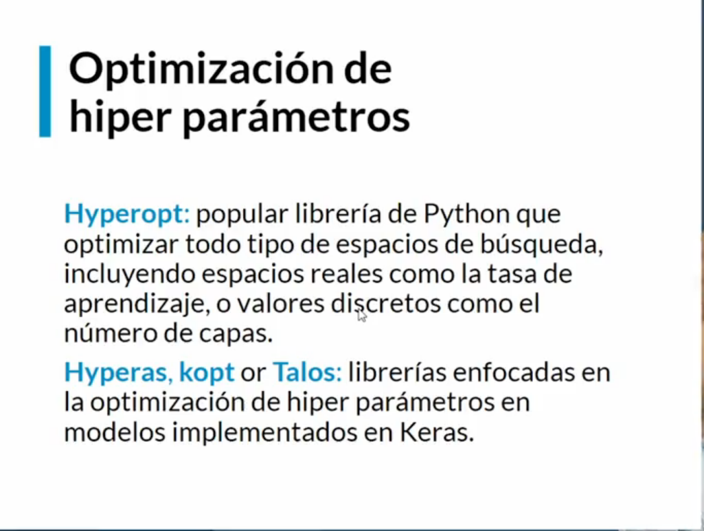

# Hiperparametros

Los hiperparametros, son todos estos datos ajustables que podemos cambiar, ofreciendo diferentes funciones o valores para resolver problemas de trasfondo

## Capas(Layers) y neuronas(neurons)

Si bien no se conoce un procedimiento que explique bien cuantas capas y neuronas debe tener algun modelo, se puede ofrecer como opcion esta tecnica ampliamente utilizada y es que segun la cantidad de entradas se debe multiplicar por dos esta cantidad de entradas y ese numero se de buscar como resultado de 2 elevado a la potencia *n*

`(2^n) >= # entradas*2`

Ex. si la cantidad de entradas es 40 entonces:

2^n >= 40 * 2 entonces 2^n >= 80 entonces 2^7 = 128

## Epocas (Epochs) e inicializadores (Initializers)

Normalmente mientras el modelo se ajusta en el entrenamiento se puede ver que ambas lineas van descendiendo al disminuir el error, cuando estas comienzan a separarsen de una manera brusca, significa que el modelo esta entrando en Sobreajuste (overfitting)

Para ello tambien otro tipo de regularizacion es la de detener el modelo tempranamente cuando se vea que se separa las lineas

Por otro lado el initializar las capas de forma aleatoria en ves de dejarlas en 0s o en 1s ha demostrado un mejor entrenamiento y aprendizaje, la funcion por defecto ya nos trae esta inicializacion aleatoria (glorot_uniform)

## Lote (Batch)

El cuanto el tamaño del batch sea mas grande sera mas rapido su entrenamiento pero probablemente pierda exactitud

En cuanto a keras existen algo conocido como callbacks que son procesos que se aplican dentro del entrenamiento y mejoran estos hiperparametros, en el orden del video que conozca existen:

EarlyStopping
Este detiene el entrenamiento al no ver mejora en una metrica como la perdidad, error, loss, val_loss, entre otras, cuenta con un parametro paciencia que permite ajustar a las epocas de no ver mejoria en el entrenamiento parara.

ModelCheckpoint
Este callback guarda los pesos y estructura del modelo entrenado por cada epoca, tambien se puede configurar para que guarde solo si el modelo ha mejorado en la epoca actual.

ReduceLROnPlateau
Tiene la funcion de monitorear una metrica de mejora configurada por el usuario y cuando no vea mejora reduce la taza de aprendizaje(Learning Rate) lo que le permite frenar el paso cada vez mas y encontrar el minimo local o global.

Tensorboard
Es un dashboard con toda la informacion y metricas pertinentes configurada en uno o varios modelos, es un tablero superdinamico que permite comparar modelos y configuraciones.

## Tecnicas tradicionales para configurar modelos

## Optmizacion de hyperparametros a traves de tools Python

