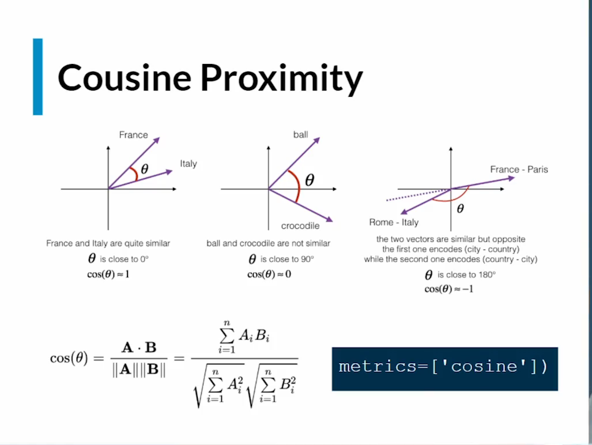
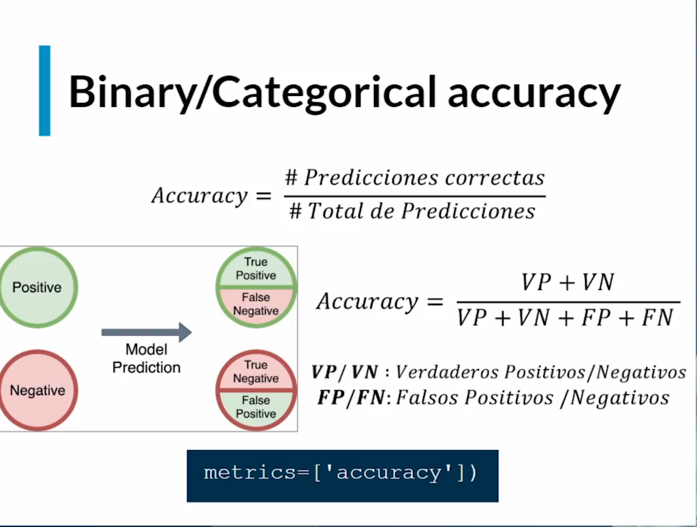
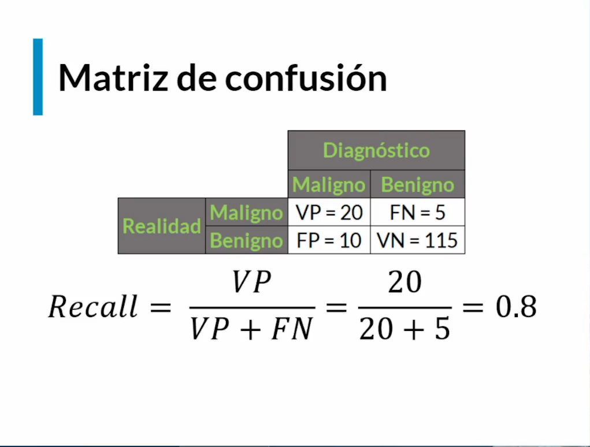
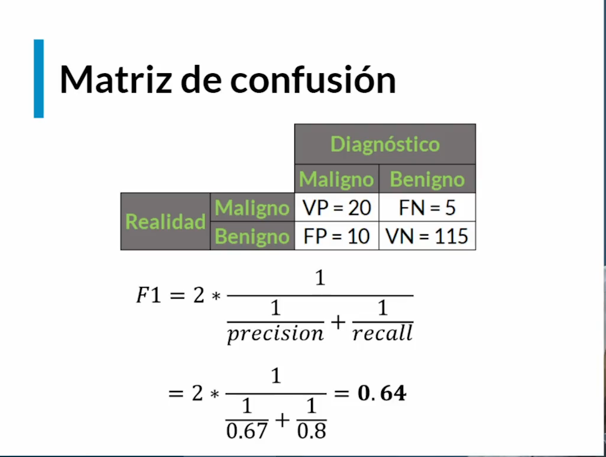
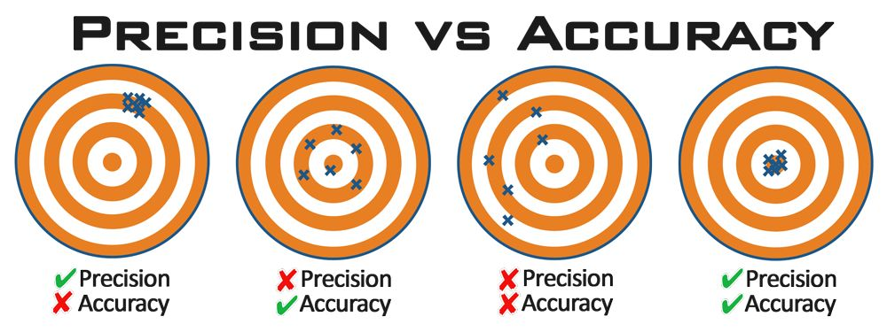

# Metricas de desempeño Regresion y clasificacion

Esta permiten ver que acertividad y confianza tiene un modelo

## Metricas asociadas a los problemas de regresiones

En este caso como es de tipo numero continuo, se pueden utilizar las mismas funciones de perdida como son: 
- MAE (Mean Absolute Error)
- MAPE (Mean Absolute Percentual Error)
- MSE (Mean Square Error)

Tambien se puede utilizar la proximidad del coseno (Cosine Proximity) que consiste en calcular el angulo que se forma entre las dos lineas a traves del coseno.

- Si el angulo es muy pequeño tendiendo a 0° significa que son similares por lo que `cosine = 1`

- Si el angulo se encuentra cerca a los 90° se asemeja mucho a lineas perpendiculares, significa que su relacion de similaridad es muy baja o nula por lo que corresponde a `cosine = 0`

- Si el angulo se encuentra o es de 180° significa que son similares pero opuestos por lo tanto `cosine = -1`

## Metricas asociadas a los problemas de clasificaciones

### Binary/Categorical accuracy

Corresponde a `accuracy = # predicciones correctas / # total de predicciones`

 

### Recall o Sensibilidad

Es la metrica que permite tener una certeza porcentual que define que tan bien esta prediciendo los verdaderos positivos, esto puede llegar a ser importante cuando es mas importante tener un modelo ajustado a predecir mejor los verdaderos positivos que los otros resultados como la busqueda de si un tumor es maligno o benigno.

### F1-Score

Es la media armonica entre `precision` y `recall` lo que arroja un resultado mas estable a nivel general del modelo.

*Existen diferencias entre `precision` y `accuracy`.*

