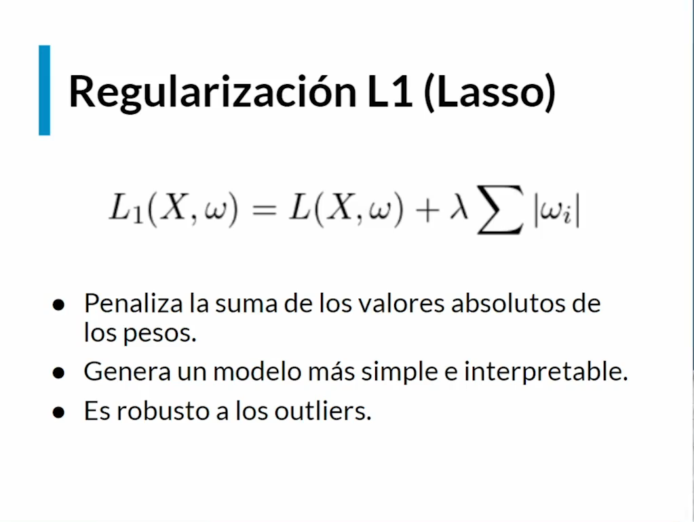
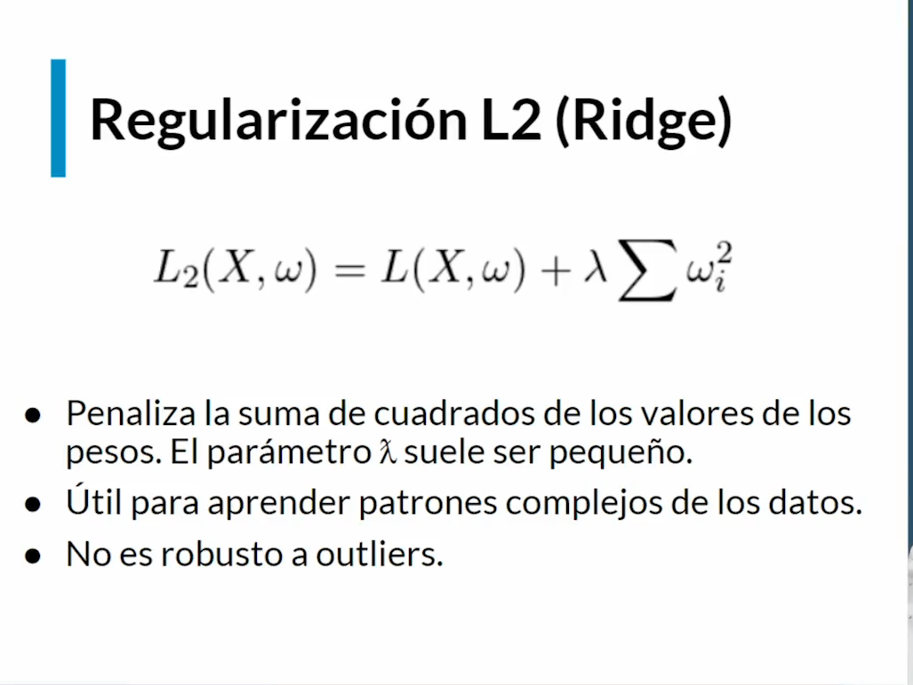
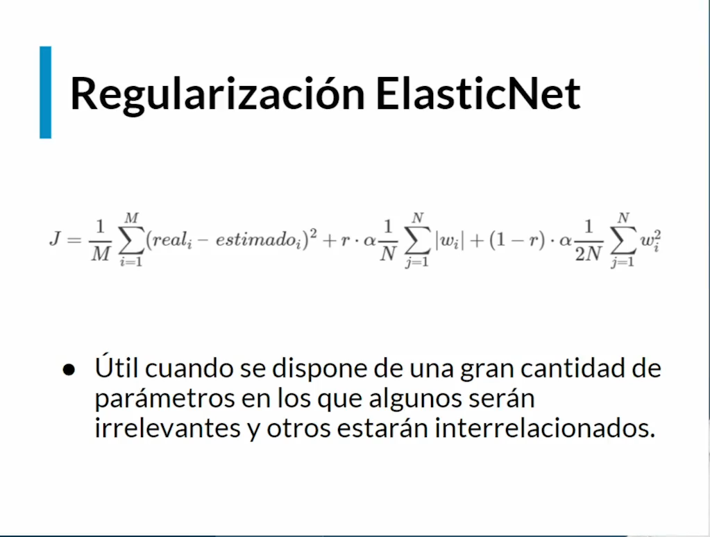

# Regularizacion

## L1

En terminos generales  es un metodo que penaliza o disminuye la complejidad, al tratar de identificar aquellas variables que no aportan significativamente el fenomeno que estamos trabajando el modelo.

## L2

Es muy similar a L1 solo que los pesos estan elevados al cuadrado, lo que posiblemente nos ayude a identificar posibles correlaciones entre variables que no aportan o que con una sola variable podriamos explicar el fenomeno de otras variables

## ElasticNet

Esta nos permite combinar L1 y L2

En Keras aparece como `L1_L2`

## Dropout

Esta regularizacion lo que hace es que al comenzar cada epoca se apagara cierto porcentaje configurado de neuronas de manera aleatoria de la capa anterior al dropout

Beneficios: 
- El entrenamiento es mas rapido debido a que no se entrena a traves de toda la red
- Se disminuye la dependencia que exista entre neuronas que son vecinas, esto disminuye el potencial problema de overfitting.

